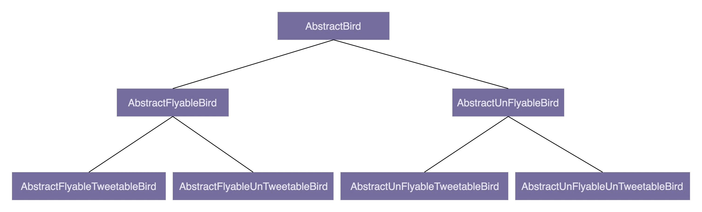

# 设计模式学习笔记

## 面向对象

- 封装 (Encapsulation)。封装也叫信息隐藏或数据访问保护。类通过暴露有限的访问接口，授权外部仅能通过类提供的方式（函数）来访问内部信息或数据。
- 抽象（Abstraction）。隐藏方法的具体实现，让调用者只需要关心方法提供了哪些功能，并不需要知道这些功能是如何实现的。
- 继承（Inheritance）。表示类之间的 is-a 关系。
- 多态（Polymorphism）。多态是指 子类可以替代父类，在实际的代码运行过程中，调用子类的方法实现。

### 抽象类 vs 接口

**抽象类**
- 不能被实例化，只能被继承
- 抽象类可以包含属性和方法。方法既可以包含代码实现，也可以不包含代码实现。不包含代码实现的方法叫抽象方法。
- 子类继承抽象类，必须实现抽象类中的所有抽象方法。

**接口**
- 接口不能包含属性
- 接口只能声明方法，不能包含代码实现
- 类实现接口的时候，必须实现接口中声明的所有方法


抽象类：is-a 关系，接口类：has-a 关系；抽象类更多为了代码复用，而接口更侧重于解耦。接口实现了约定和实现相分离，可以降低代码间的耦合性，提高代码的可扩展性。

### 基于抽象而非实现编程

越抽象、越顶层、越脱离具体某一实现的设计，越能提高代码的灵活性，越能应对未来的需求变化。封装不稳定的实现，暴露稳定的接口。

这里假设有一段上传图片到阿里云的代码。想想你会怎么写。

- 函数的命名不能暴露任何实现细节。比如，`uploadToAliyun()` 应该改为 `upload()`
- 封装具体的实现细节。比如，跟阿里云相关的特殊上传（下载）流程不应该暴露给调用者。我们对上传（下载）流程进行封装，对外提供一个包裹所有上传（下载）细节的方法，给调用者使用。
- 从实现类定义抽象的接口。具体的实现类都依赖统一的接口定义。

### 多用组合少用继承

**少用继承**是怕继承层次过深，这时继承关系复杂，会影响到代码的可读性和可维护性。

比如抽象类「鸟」，有会飞的，不会飞的，会叫的，不会叫的，会下蛋的，不会下蛋的，



通过组合（composition）、接口、委托（delegation）三个技术手段，可以解决继承存在的问题。

用接口来判定会不会飞、叫、下蛋。如果每个鸟的飞实现都一样，再定义其实现类（Java8 之后可以用接口的 Default），用组合方式来消除代码重复。

```Java
public interface Flyable {
  void fly();
}

public interface Tweetable {
  void tweet();
}

public interface EggLayable {
  void layEgg();
}

public class FlyAbility implements Flyable {
     @Override 
     public void fly() { //... }
}

// 省略 TweetAbility，EggLayAbility

public class Ostrich implements Tweetable, EggLayable {//鸵鸟
    private TweetAbility tweetAbility = new TweetAbility(); //组合
    private EggLayAbility eggLayAbility = new EggLayAbility(); //组合 
    //... 省略其他属性和方法... 
    @Override 
    public void tweet() { 
        tweetAbility.tweet(); // 委托 
    } 

    @Override 
    public void layEgg() { 
        eggLayAbility.layEgg(); // 委托 
    }
}
```

继承有三个作用：表示 is-a 关系，支持多态，代码复用。is-a 关系可以通过组合和接口的 has-a 关系来代替；多态可以利用接口实现；代码复用可以通过组合和委托实现。

### 面向对象开发

当接到一个需求的时候，要进行面向对象分析（OOA）、面向对象设计（OOD）和面向对象编程（OOP）。

面向对象分析是对需求进行一轮轮的分析，对模糊的任务需求梳理出清晰的任务流程。面对对象分析的产出是详细的需求描述。

面向对象设计的产出是类。将需求描述转化为具体的类的设计。主要包含以下部分：
- 划分职责进而识别出有哪些类。根据需求描述，把涉及的功能点罗列出来，然后去看哪些功能点职责相近，操作同样的属性，可否归为同一个类
- 定义类及其属性和方法。识别出需求描述中的动词，作为候选的方法，再进一步筛选出真正的方法，吧功能点中涉及的名词，作为候选属性，然后同样再进行过滤筛选。
- 定义类与类之间的交互关系
- 将类组装起来并提供执行入口

## 设计原则

### 单一职责原则（SRP）

Single Responsibility Principle。A class or module should have a single responsibility.

简单说，一个类包含了两个或者两个以上业务不相干的功能，那我们就说它职责不够单一，应该将它拆分成多个功能更加单一、粒度更细的类。

在不同的应用场景、不同阶段的需求背景下，对同一个类的职责是否单一的判定，可能都是不一样的。在某种应用场景或者当下的需求背景下，一个类的设计可能已经满足单一职责原则了，但如果换个应用场景或者在未来的某个需求背景下，可能就不满足了，需要继续拆分成粒度更细的类。

在实际开发中，我们可以先写一个粗粒度的类，满足业务需求，随着业务的发展，如果粗粒度的类越来越庞大，代码越来越多，这个时候，我们就可以将这个粗粒度的类，拆分成几个更细粒度的类。这就是所谓的**持续重构**。

一些判断职责单一的 tips：
- 类中的代码行数、函数或属性过多，会影响代码的可读性和可维护性，就要考虑对类进行拆分
- 类依赖的其他类过多，或者依赖类的其他类过多，不符合高内聚、低耦合的设计思想，就要考虑对类进行拆分
- 私有方法过多，就要考虑能否将私有方法独立到新的类中，设置为 public 方法，供更多的类使用
- 比较难给类起一个合适名字，很难用一个业务名词概括，或者只能用一些笼统的 Manager、Context 之类的词语来命名，说明类的职责定义的可能不够清晰
- 类中大量的方法都是集中操作类中的某几个属性。比如，在 UserInfo 中，如果一般的方法都是在操作 address 信息，那就可以考虑将这几个属性和对应的方法拆分出来。

### 开闭原则（OCP）

Open Closed Principle。Software entities (modules, classes, functions, etc) should be open for extension, but closed for modification。

添加一个新的功能应该是，在已有代码基础上扩展代码（新增模块、类、方法等），而非修改已有代码（修改模块、类、方法等）

举例：API 接口监控告警的代码，其中，`AlertRule`存储告警规则，可以自由设置。`Notification`是告警通知类，支持邮件、短信等多种通知渠道。`NotificationEmergencyLevel` 表示通知的紧急程度，包括 SEVERE（严重）、URGENCY（紧急）、NORMAL（普通）、TRIVIAL（无关紧要），不同的紧急程度对应不同的发送渠道。

```Java
public class Alert {
  private AlertRule rule;
  private Notification notification;

  public Alert(AlertRule rule, Notification notification) {
    this.rule = rule;
    this.notification = notification;
  }

  public void check(String api, long requestCount, long errorCount, long durationOfSeconds) {
    long tps = requestCount / durationOfSeconds;
    if (tps > rule.getMatchedRule(api).getMaxTps()) {
      notification.notify(NotificationEmergencyLevel.URGENCY, "...");
    }
    if (errorCount > rule.getMatchedRule(api).getMaxErrorCount()) {
      notification.notify(NotificationEmergencyLevel.SEVERE, "...");
    }
  }
}
```

现在，如果我们需要添加一个功能，当每秒钟接口超时请求个数，超过某个预先设置的最大阈值时，我们也要触发告警发送通知.

```Java
public class Alert {
  // ...省略AlertRule/Notification属性和构造函数...
  
  // 改动一：添加参数timeoutCount
  public void check(String api, long requestCount, long errorCount, long timeoutCount, long durationOfSeconds) {
    long tps = requestCount / durationOfSeconds;
    if (tps > rule.getMatchedRule(api).getMaxTps()) {
      notification.notify(NotificationEmergencyLevel.URGENCY, "...");
    }
    if (errorCount > rule.getMatchedRule(api).getMaxErrorCount()) {
      notification.notify(NotificationEmergencyLevel.SEVERE, "...");
    }
    // 改动二：添加接口超时处理逻辑
    long timeoutTps = timeoutCount / durationOfSeconds;
    if (timeoutTps > rule.getMatchedRule(api).getMaxTimeoutTps()) {
      notification.notify(NotificationEmergencyLevel.URGENCY, "...");
    }
  }
}
```

上面代码对接口进行了修改，意味着调用这个接口的代码都要做相应的修改，相应的单元测试也要修改。显然是不符合「开闭原则」的。

如何通过「扩展」的方式来实现同样的功能呢？

重构一下 Alert 的代码，让它的扩展性更好一些。重构的内容主要包含两个部分：
1. 将 `check()` 函数的多个入参封装成`ApiStatInfo`类
2. 引入 `handler` 的概念，将 `if` 逻辑判断分散到各个 `handler` 中。

```Java
public class Alert {
  private List<AlertHandler> alertHandlers = new ArrayList<>();

  public void addAlertHandler(AlertHandler alertHandler) {
    this.alertHandlers.add(alertHandler);
  }

  public check(ApiStatInfo apiStatInfo) {
    for (AlertHandler handler : alertHandlers) {
        handler.check(apiStatInfo);
    }
  }
}

public class ApiStatInfo { //省略constructor/getter/setter方法
  private String api; 
  private long requestCount; 
  private long errorCount; 
  private long durationOfSeconds;
}

public abstract class AlertHandler {
  protected AlertRule rule;
  protected Notification notification;
  public AlertHandler(AlertRule rule, Notification notification) {
    this.rule = rule;
    this.notification = notification;
  }

  public abstract void check(ApiStatInfo apiStatInfo);
}

public class TpsAlertHandler extends AlertHandler {
  public TpsAlertHandler(AlertRule rule, Notification notification) {
    super(rule, notification);
  }

  @Override
  public void check(ApiStatInfo apiStatInfo) {
    long tps = apiStatInfo.getRequestCount()/ apiStatInfo.getDurationOfSeconds();
    if (tps > rule.getMatchedRule(apiStatInfo.getApi()).getMaxTps()) {
      notification.notify(NotificationEmergencyLevel.URGENCY, "...");
    }
  }
}

public class ErrorAlertHandler extends AlertHandler {
  public ErrorAlertHandler(AlertRule rule, Notification notification){
    super(rule, notification);
  }

  @Override
  public void check(ApiStatInfo apiStatInfo) {
    if (apiStatInfo.getErrorCount() > rule.getMatchedRule(apiStatInfo.getApi()).getMaxErrorCount()) {
      notification.notify(NotificationEmergencyLevel.SEVERE, "...");
    }
  }
}
```

Alert 的使用。其中 `ApplicationContext` 是一个单例类，负责 Alert 的创建、组装、初始化

```Java
public class ApplicationContext {
  private AlertRule alertRule;
  private Notification notification;
  private Alert alert;

  public void initializeBeans() {
    alertRule = new AlertRule();
    notification = new Notification();
    alert = new Alert;
    alert.addAlertHandler(new TpsAlertHandler(alertRule, notification));
    alert.addAlertHandler(new ErrorAlertHandler(alertRule, notification));
  }

  // 饿汉式单例
  private static final ApplicationContext instance = new ApplicationContext();
  private ApplicationContext() {
    initializeBeans();
  }
  public static ApplicationContext getInstance() {
    return instance;
  }

  public Alert getAlert() {return alert;}
}

public class Demo {
  public static void mian(String[] args) {
    ApiStatInfo apiStatInfo = new ApiStatInfo();
    // ...省略设置apiStatInfo数据值的代码 
    ApplicationContext.getInstance().getAlert().check(apiStatInfo);
  }
}
```

重构之后，如果再添加上面讲到的新功能，需要改动的有下面四处：
1. 在 ApiStatInfo 类中添加新的属性 timeoutCount。
2. 添加新的 TimeoutAlertHandler 类
3. 在 ApplicationContext 类的 initializeBeans() 方法中，往 alert 对象中注册新的 timeoutAlertHandler。
4. 在使用 Alert 类的时候，需要给 check() 函数的入参 apiStatInfo 对象设置 timeoutCount 的值。

```Java

public class Alert { // 代码未改动... }
public class ApiStatInfo {//省略constructor/getter/setter方法
  private String api;
  private long requestCount;
  private long errorCount;
  private long durationOfSeconds;
  private long timeoutCount; // 改动一：添加新字段
}
public abstract class AlertHandler { //代码未改动... }
public class TpsAlertHandler extends AlertHandler {//代码未改动...}
public class ErrorAlertHandler extends AlertHandler {//代码未改动...}
// 改动二：添加新的handler
public class TimeoutAlertHandler extends AlertHandler {//省略代码...}

public class ApplicationContext {
  private AlertRule alertRule;
  private Notification notification;
  private Alert alert;
  
  public void initializeBeans() {
    alertRule = new AlertRule(/*.省略参数.*/); //省略一些初始化代码
    notification = new Notification(/*.省略参数.*/); //省略一些初始化代码
    alert = new Alert();
    alert.addAlertHandler(new TpsAlertHandler(alertRule, notification));
    alert.addAlertHandler(new ErrorAlertHandler(alertRule, notification));
    // 改动三：注册handler
    alert.addAlertHandler(new TimeoutAlertHandler(alertRule, notification));
  }
  //...省略其他未改动代码...
}

public class Demo {
  public static void main(String[] args) {
    ApiStatInfo apiStatInfo = new ApiStatInfo();
    // ...省略apiStatInfo的set字段代码
    apiStatInfo.setTimeoutCount(289); // 改动四：设置tiemoutCount值
    ApplicationContext.getInstance().getAlert().check(apiStatInfo);
}
```

重构之后的代码更加灵活和易扩展。如果我们要想添加新的告警逻辑，只需要基于扩展的方式创建新的 handler 类即可，不需要改动原来的 check() 函数的逻辑。而且，我们只需要为新的 handler 类添加单元测试，老的单元测试都不会失败，也不用修改。

方法：
- 扩展意识、抽象意识、封装意识
- 识别出代码可变部分和不可变部分，将可变部分封装起来，隔离变化，提供抽象化的不可变接口，给上层使用。

假设代码中通过 Kafka 发送异步消息，对于这样的功能，要学会将其抽象成一组跟具体消息队列（Kafka）无关的异步消息接口。所有上层系统都依赖这组抽象的接口编程，并通过依赖注入的方式来调用。当要替换消息队列时，比如将 Kafka 替换成 RocketMQ，可以很方便地拔掉老的消息队列实现，插入新的消息队列实现。

```Java
public interface MessageQueue { 
  //.... 
}
public class KafkaMessageQueue implements MessageQueue { // ... }
public class RocketMQMessageQueue implements MessageQueue {//...}

public interface MessageFormatter { //... }
public class JsonMessageFormatter implements MessageFormatter {//...}
public class ProtoBufMessageFormatter implements MessageFormatter {//...}

public class Demo {
  private MessageQueue msgQueue; // 基于接口而非实现编程
  public Demo(MessageQueue msgQueue) { // 依赖注入
    this.msgQueue = msgQueue;
  }

  // msgFormatter：多态、依赖注入
  public void sendNotification(Notification notification, MessageFormatter msgFormatter) { 
    //... 
  }
}
```

对于一些比较确定的、短期内可能就会扩展，或者需求改动对代码结构影响比较大的情况，或者实现成本不高的扩展点，在编写代码的时候之后，我们就可以事先做些扩展性设计。但对于一些不确定未来是否要支持的需求，或者实现起来比较复杂的扩展点，我们可以等到有需求驱动的时候，再通过重构代码的方式来支持扩展的需求。

### 里式替换原则（LSP）

Liskov Substitution Principle. If S is a subtype of T, then objects of type T may be replaced with objects of type S, without breaking the program.

子类对象能够替换程序中父类对象出现的任何地方，并且保证原来的逻辑行为不变及正确性不被破坏。

里式替换原则还有另外一个更加能落地、更有指导意义的描述，叫“Design By Contract”，按照协议来设计。子类在设计的时候，要遵守父类的行为约定（或者叫协议）。父类定义了函数的行为约定，那子类可以改变函数的内部实现逻辑，但不能改变函数原有的行为约定，这里的行为约定包括：函数声明要实现的功能；对输入、输出、异常的约定；甚至包括注释中所罗列的任何特殊说明。

### 接口隔离原则（ISP）

Interface Segregation Principle. Clients should not be forced to depend upon interfaces that they do not use.

这里面的“接口”，我们可以把它理解成下面三种东西：
1. 一组 API 接口集合
2. 单个 API 接口或函数
3. OOP 中的接口概念

### 依赖反转原则

#### 控制反转 IOC

Inversion of Control。

举例说明什么是控制反转

```Java
public class UserServiceTest {
  public static boolean doTest() {
    // ... 
  }
  
  public static void main(String[] args) {//这部分逻辑可以放到框架中
    if (doTest()) {
      System.out.println("Test succeed.");
    } else {
      System.out.println("Test failed.");
    }
  }
}
```

上面代码中所有流程都是由程序员控制。现在抽象出一个框架，用框架来实现同样的功能：

```Java
public abstract class TestCase {
  public void run() {
    if (doTest()) {
      System.out.println("Test succeed");
    } else {
      System.out.println("Test failed");
    }
  }

  public abstract boolean doTest();
}

public class JunitApplication {
  private static final List<TestCase> testCases = new ArrayList<>();

  public static void register(TestCase testCase) {
    testCases.add(testCase);
  }

  public static final void main(String[] args) {
    for (TestCase case: testCases) {
      case.run();
    }
  }
}
```

把这个简化版本的测试框架引入到工程中之后，我们只需要在框架预留的扩展点，也就是 TestCase 类中的 doTest() 抽象函数中，填充具体的测试代码就可以实现之前的功能了。完全不需要在负责执行流程的 main() 函数了。

```Java
public class UserServiceTest extends TestCase {
  @Override
  public boolean doTest() {
    //.....
  }
}

// 注册操作还可以通过配置的方式来实现，不需要程序员显示调用register()
JunitApplication.register(new UserServiceTest();
```

这就是通过框架来实现“控制反转”的例子。框架提供了一个可扩展的代码骨架，用来组装对象、管理整个执行流程。利用框架开发的时候，只需要往预留的扩展点上添加跟业务相关的代码，就可以利用框架来驱动整个程序流程的执行。

这里的「控制」是指对程序执行流程的控制，而「反转」指的是在没有使用框架之前，程序员自己控制整个程序的执行。在使用框架之后，整个程序的执行流程可以通过框架来控制。流程的控制权从程序员“反转”到了框架。

控制反转并不是一种具体的实现技巧，而是一个比较笼统的设计思想，一般用来指导框架层面的设计。

#### 依赖注入（DI）

Dependency Injection。

依赖注入跟控制反转恰恰相反，它是一种具体的编码技巧。用一句话概括依赖注入就是：不通过 new() 的方式在类内部创建依赖类对象，而是将依赖的类对象在外部创建好之后，通过构造函数、函数参数等方式传递（或注入）给类使用。

下面例子中 Notification 类负责消息推送，依赖 MessageSender 类实现推送商品促销、验证码等消息给用户。我们分别用依赖注入和非依赖注入两种方式来实现一下。

**非依赖注入实现方式**
```Java
public class Notification {
  private MessageSender messageSender;

  public Notification() {
    this.messageSender = new MessageSender();
  }

  public void sendMessage(String cellphone, String message) {
    //...省略校验逻辑等...
    this.messageSender.send(cellphone, message);
  }
}

public class MessageSender {
  public void send(String cellphone, String message) {
    //....
  }
}

// 使用 Notification
Notification notification = new Notification();
```

**依赖注入的实现方式**

```Java
public class Notification {
  private MessageSender messageSender;

  // 通过构造函数将 messageSender 传递进来
  public Notification(MessageSender messageSender) {
    this.messageSender = messageSender;
  }

  public void sendMessage(String cellphone, String message) {
    //...省略校验逻辑等...
    this.messageSender.send(cellphone, message);
  }
}

MessageSender messageSender = new MessageSender();
Notification notification = new Notification(messageSender);
```

#### 依赖注入框架

上面例子中，还是要通过 new 来创建 messageSender 对象。在实际的软件开发中，一些项目可能会涉及几十上百个类，类对象的创建和依赖注入也会变得非常复杂。而对象创建和依赖注入的工作，本身跟具体的业务无关，我们完全可以抽象成框架来自动完成。这个框架就是“依赖注入框架”。我们只需要通过依赖注入框架提供的扩展点，简单配置一下所有需要创建的类对象、类与类之间的依赖关系，就可以实现由框架来自动创建对象、管理对象的生命周期、依赖注入等原本需要程序员来做的事情。

#### 依赖反转原则（DIP）

High-level modules shouldn't depend on low-level modules. Both modules should depend on an abstractions. In addition, abstractions should depend on details. Details depend on abstractions.

高层模块不要依赖底层模块，高层模块和底层模块应该通过抽象来相互依赖。除此之外，抽象不要依赖具体实现细节，具体实现细节依赖抽象。

这条原则主要还是用来指导框架层面的设计。