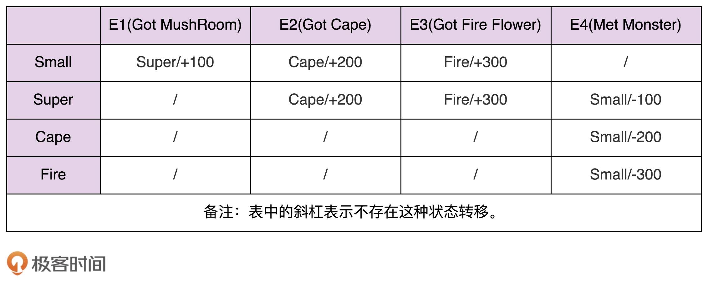

# 状态模式

状态模式一般用来实现状态机。而状态机常用在游戏、工作流引擎等系统开发中。

## 有限状态机

Finit State Machine（FSM），有限状态机，简称状态机。由三部分组成：
- 状态 State
- 事件 Event
- 动作 Action

其中，事件也称为转移条件（Transition Condition）。事件触发状态的转移及动作的执行。

以超级马里奥为例，马里奥有不同形态：小马里奥（Small Mario）、超级马里奥（Super Mario）、火焰马里奥（Fire Mario）、斗篷马里奥（Cape Mario）等等，不同形态就是不同的状态。在不同的游戏情节（吃蘑菇）下，各个形态会互相转化，并相应的增减积分。这里游戏情节就是事件，增减积分就是动作。


那么来实现一下上面的状态机。

```Java
public enum State {
    SMALL(0),
    SUPER(1),
    FIRE(2),
    CAPE(3);

    private int value;

    private State(int value) {
        this.value = value;
    }

    public int getValue() {
        return this.value;
    }
}


public class MarioStateMachine {
    private int score;
    private State currentState;

    public MarioStateMachine() {
        this.score = 0;
        this.currentState = State.SMALL;
    }

    public void obtainMushRoom() {
        if (currentState.equals(State.SMALL)) {
            this.currentState = State.SUPER;
            this.score += 100;
        }
    }

    public void obtainCape() {
        if (currentState.equals(State.SMALL) || currentState.equals(State.SUPER) ) {
            this.currentState = State.CAPE;
            this.score += 200;
        }
    }

    public void obtainFireFlower() {
        if (currentState.equals(State.SMALL) || currentState.equals(State.SUPER) ) {
            this.currentState = State.FIRE;
            this.score += 300;
        }
    }

    public void meetMonster() {
        if (currentState.equals(State.SUPER)) {
            this.currentState = State.SMALL;
            this.score -= 100;
            return;
        }

        if (currentState.equals(State.CAPE)) {
            this.currentState = State.SMALL;
            this.score -= 200;
            return;
        }

        if (currentState.equals(State.FIRE)) {
            this.currentState = State.SMALL;
            this.score -= 300;
            return;
        }
    }

    public int getScore() {
        return this.score;
    }

    public State getCurrentState() {
        return this.currentState;
    }
}
```

上面的实现方法参照状态转移图，将每一个状态转移，原模原样地直译成代码。这样编写的代码会包含大量的 if-else 或 switch-case 分支判断逻辑。

对于复杂的状态机来说，这种实现方法极易漏写或者错写某个状态转移。此外，代码中充斥量大量的 if-else 分支判断逻辑，可读性和可维护性都很差。

### 查表法

其实，除了用状态转移图表示之外，状态机还可以用二维表来表示。



第一维表示当前状态，第二维表示事件，值表示当前状态经过事件之后，转移到的新状态及执行的动作。

据此，用查表法来实现代码，可读性和可维护性更好。当修改状态机时，我们只需要修改 transitionTable 和 actionTable 两个二维数组即可。如果我们把这两个二维数组存储在配置文件中，当需要修改状态机时，我们甚至可以不修改任何代码，只需要修改配置文件就可以了。

```Java
public enum Event {
    GOT_MUSHROOM(0),
    GOT_CAPE(1),
    GOT_FIRE(2),
    MET_MONSTER(3);

    private int value;

    private Event(int value) {
        this.value = value;
    }

    public int getValue() {
        return this.value;
    }
}

public class MarioStateMachine {
    private int score;
    private State currentState;

    private static final State[][] transitionTable = {
            {SUPER, CAPE, FIRE, SMALL},
            {SUPER, CAPE, FIRE, SMALL},
            {CAPE, CAPE, CAPE, SMALL},
            {FIRE, FIRE, FIRE, SMALL}
    };

    private static final int[][] actionTable = {
            {+100, +200, +300, +0},
            {+0, +200, +300, -100},
            {+0, +0, +0, -200},
            {+0, +0, +0, -300}
    };

    public MarioStateMachine() {
        this.score = 0;
        this.currentState = State.SMALL;
    }

    public void obtainMushRoom() {
        executeEvent(Event.GOT_MUSHROOM);
    }

    public void obtainCape() {
        executeEvent(Event.GOT_CAPE);
    }

    public void obtainFireFlower() {
        executeEvent(Event.GOT_FIRE);
    }

    public void meetMonster() {
        executeEvent(Event.MET_MONSTER);
    }

    private void executeEvent(Event event) {
        int stateValue = currentState.getValue();
        int eventValue = event.getValue();
        this.currentState = transitionTable[stateValue][eventValue];
        this.score += actionTable[stateValue][eventValue];
    }

    public int getScore() {
        return this.score;
    }

    public State getCurrentState() {
        return this.currentState;
    }

}
```

### 状态模式

在查表法的代码实现中，事件触发的动作只是简单的积分加减，所以，我们用一个 int 类型的二维数组 actionTable 就能表示，二维数组中的值表示积分的加减值。但是，如果要执行的动作并非这么简单，而是一系列复杂的逻辑操作（比如加减积分、写数据库，还有可能发送消息通知等等），我们就没法用如此简单的二维数组来表示了。这也就是说，查表法的实现方式有一定局限性。

状态模式通过将事件触发的状态转移和动作执行拆分到不同的状态类中，来避免分支判断逻辑。

在下面代码中，IMario 是状态的接口，定义了所有的事件。SmailMario、SuperMario、CapeMario、FireMerio 是 IMario 接口的实现类，分别对应状态机的四个状态。原来所有的状态转移和动作执行的代码逻辑，被分散到了这 4 个状态类中。

```Java
public interface IMario {
    State getName();

    void obtainMushRoom();
    void obtainCape();
    void obtainFireFlower();
    void meetMonster();
}

public class SmallMario implements IMario {
    private MarioStateMachine stateMachine;

    public SmallMario(MarioStateMachine stateMachine) { 
        this.stateMachine = stateMachine; 
    }

    @Override
    public State getName() {
        return State.SMALL;
    }

    @Override
    public void obtainMushRoom() {
        stateMachine.setCurrentState(new SuperMario(stateMachine));
        stateMachine.setScore(stateMachine.getScore() + 100);
    }
    @Override
    public void obtainCape() {
        stateMachine.setCurrentState(new CaperMario(stateMachine));
        stateMachine.setScore(stateMachine.getScore() + 200);
    }

    @Override 
    public void obtainFireFlower() { 
        stateMachine.setCurrentState(new FireMario(stateMachine)); 
        stateMachine.setScore(stateMachine.getScore() + 300); 
    } 

    @Override 
    public void meetMonster() { 
        // do nothing... 
    }
}

// 省略CapeMario、FireMario类...

public class MarioStateMachine {
    private int score;
    private IMario currentState;

    public MarioStateMachine() {
        this.score = 0;
        this.currentState = new SmallMario(this);
    }

    public void obtainMushRoom() {
        this.currentState.obtainMushRoom();
    }

    public void obtainCape() {
        this.currentState.obtainCape();
    }

    public void obtainFireFlower() {
        this.currentState.obtainFireFlower();
    }

    public void meetMonster() {
        this.currentState.meetMonster();
    }

    public int getScore() {
        return this.score;
    }

    public State getCurrentState() {
        return this.currentState.getName();
    }

    public void setScore(int score) {
        this.score = score;
    }

    public void setCurrentState(IMario currentState) {
        this.currentState = currentState;
    }
}
```

MarioStateMachine 和各个状态类之间是双向依赖关系。MarioStateMachine 依赖各个状态类是理所当然的，但是，反过来，各个状态类为什么要依赖 MarioStateMachine 呢？这是因为，各个状态类需要更新 MarioStateMachine 中的两个变量，score 和 currentState。

我们可以将状态类设计成单例，毕竟状态类中不包含任何成员变量。但是，当将状态类设计成单例之后，我们就无法通过构造函数来传递 MarioStateMachine 了，而状态类又要依赖 MarioStateMachine，那该如何解决这个问题呢？在这里，我们可以通过函数参数将 MarioStateMachine 传递进状态类。

```Java

public interface IMario {
  State getName();
  void obtainMushRoom(MarioStateMachine stateMachine);
  void obtainCape(MarioStateMachine stateMachine);
  void obtainFireFlower(MarioStateMachine stateMachine);
  void meetMonster(MarioStateMachine stateMachine);
}

public class SmallMario implements IMario {
  private static final SmallMario instance = new SmallMario();
  private SmallMario() {}
  public static SmallMario getInstance() {
    return instance;
  }

  @Override
  public State getName() {
    return State.SMALL;
  }

  @Override
  public void obtainMushRoom(MarioStateMachine stateMachine) {
    stateMachine.setCurrentState(SuperMario.getInstance());
    stateMachine.setScore(stateMachine.getScore() + 100);
  }

  @Override
  public void obtainCape(MarioStateMachine stateMachine) {
    stateMachine.setCurrentState(CapeMario.getInstance());
    stateMachine.setScore(stateMachine.getScore() + 200);
  }

  @Override
  public void obtainFireFlower(MarioStateMachine stateMachine) {
    stateMachine.setCurrentState(FireMario.getInstance());
    stateMachine.setScore(stateMachine.getScore() + 300);
  }

  @Override
  public void meetMonster(MarioStateMachine stateMachine) {
    // do nothing...
  }
}

// 省略SuperMario、CapeMario、FireMario类...

public class MarioStateMachine {
  private int score;
  private IMario currentState;

  public MarioStateMachine() {
    this.score = 0;
    this.currentState = SmallMario.getInstance();
  }

  public void obtainMushRoom() {
    this.currentState.obtainMushRoom(this);
  }

  public void obtainCape() {
    this.currentState.obtainCape(this);
  }

  public void obtainFireFlower() {
    this.currentState.obtainFireFlower(this);
  }

  public void meetMonster() {
    this.currentState.meetMonster(this);
  }

  public int getScore() {
    return this.score;
  }

  public State getCurrentState() {
    return this.currentState.getName();
  }

  public void setScore(int score) {
    this.score = score;
  }

  public void setCurrentState(IMario currentState) {
    this.currentState = currentState;
  }
}
```

像游戏这种比较复杂的状态机，包含的状态比较多，我优先推荐使用查表法，而状态模式会引入非常多的状态类，会导致代码比较难维护。相反，像电商下单、外卖下单这种类型的状态机，它们的状态并不多，状态转移也比较简单，但事件触发执行的动作包含的业务逻辑可能会比较复杂，所以，更加推荐使用状态模式来实现。