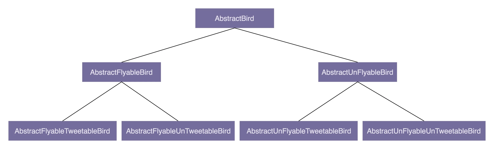

## 面向对象

- 封装 (Encapsulation)。封装也叫信息隐藏或数据访问保护。类通过暴露有限的访问接口，授权外部仅能通过类提供的方式（函数）来访问内部信息或数据。
- 抽象（Abstraction）。隐藏方法的具体实现，让调用者只需要关心方法提供了哪些功能，并不需要知道这些功能是如何实现的。
- 继承（Inheritance）。表示类之间的 is-a 关系。
- 多态（Polymorphism）。多态是指 子类可以替代父类，在实际的代码运行过程中，调用子类的方法实现。

### 抽象类 vs 接口

**抽象类**
- 不能被实例化，只能被继承
- 抽象类可以包含属性和方法。方法既可以包含代码实现，也可以不包含代码实现。不包含代码实现的方法叫抽象方法。
- 子类继承抽象类，必须实现抽象类中的所有抽象方法。

**接口**
- 接口不能包含属性
- 接口只能声明方法，不能包含代码实现
- 类实现接口的时候，必须实现接口中声明的所有方法


抽象类：is-a 关系，接口类：has-a 关系；抽象类更多为了代码复用，而接口更侧重于解耦。接口实现了约定和实现相分离，可以降低代码间的耦合性，提高代码的可扩展性。

### 基于抽象而非实现编程

越抽象、越顶层、越脱离具体某一实现的设计，越能提高代码的灵活性，越能应对未来的需求变化。封装不稳定的实现，暴露稳定的接口。

这里假设有一段上传图片到阿里云的代码。想想你会怎么写。

- 函数的命名不能暴露任何实现细节。比如，`uploadToAliyun()` 应该改为 `upload()`
- 封装具体的实现细节。比如，跟阿里云相关的特殊上传（下载）流程不应该暴露给调用者。我们对上传（下载）流程进行封装，对外提供一个包裹所有上传（下载）细节的方法，给调用者使用。
- 从实现类定义抽象的接口。具体的实现类都依赖统一的接口定义。

### 多用组合少用继承

**少用继承**是怕继承层次过深，这时继承关系复杂，会影响到代码的可读性和可维护性。

比如抽象类「鸟」，有会飞的，不会飞的，会叫的，不会叫的，会下蛋的，不会下蛋的，



通过组合（composition）、接口、委托（delegation）三个技术手段，可以解决继承存在的问题。

用接口来判定会不会飞、叫、下蛋。如果每个鸟的飞实现都一样，再定义其实现类（Java8 之后可以用接口的 Default），用组合方式来消除代码重复。

```Java
public interface Flyable {
  void fly();
}

public interface Tweetable {
  void tweet();
}

public interface EggLayable {
  void layEgg();
}

public class FlyAbility implements Flyable {
     @Override 
     public void fly() { //... }
}

// 省略 TweetAbility，EggLayAbility

public class Ostrich implements Tweetable, EggLayable {//鸵鸟
    private TweetAbility tweetAbility = new TweetAbility(); //组合
    private EggLayAbility eggLayAbility = new EggLayAbility(); //组合 
    //... 省略其他属性和方法... 
    @Override 
    public void tweet() { 
        tweetAbility.tweet(); // 委托 
    } 

    @Override 
    public void layEgg() { 
        eggLayAbility.layEgg(); // 委托 
    }
}
```

继承有三个作用：表示 is-a 关系，支持多态，代码复用。is-a 关系可以通过组合和接口的 has-a 关系来代替；多态可以利用接口实现；代码复用可以通过组合和委托实现。

### 面向对象开发

当接到一个需求的时候，要进行面向对象分析（OOA）、面向对象设计（OOD）和面向对象编程（OOP）。

面向对象分析是对需求进行一轮轮的分析，对模糊的任务需求梳理出清晰的任务流程。面对对象分析的产出是详细的需求描述。

面向对象设计的产出是类。将需求描述转化为具体的类的设计。主要包含以下部分：
- 划分职责进而识别出有哪些类。根据需求描述，把涉及的功能点罗列出来，然后去看哪些功能点职责相近，操作同样的属性，可否归为同一个类
- 定义类及其属性和方法。识别出需求描述中的动词，作为候选的方法，再进一步筛选出真正的方法，吧功能点中涉及的名词，作为候选属性，然后同样再进行过滤筛选。
- 定义类与类之间的交互关系
- 将类组装起来并提供执行入口